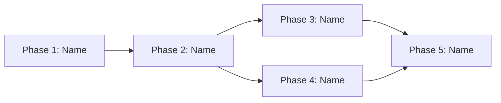

# Phases README Template

Use this template when creating the phases overview file.

## Template

````markdown
# <Feature Name> - Phases Overview

**Feature:** [Brief description]
**Spec:** [../spec.md](../spec.md)
**Plan:** [../plan.md](../plan.md)
**Status:** DRAFT | APPROVED

## Phase Summary

| Phase | Name | Status | Dependencies |
|-------|------|--------|--------------|
| 1 | <name> | `not-started` | None |
| 2 | <name> | `not-started` | Phase 1 |
| 3 | <name> | `not-started` | Phase 2 |

## Dependency Diagram



## Phase Files

- [Phase 1: <Name>](phase-1-<name>.md)
- [Phase 2: <Name>](phase-2-<name>.md)
- [Phase 3: <Name>](phase-3-<name>.md)
````

## Guidelines

- Use mermaid `graph LR` (left-to-right) for the dependency diagram
- Show parallel phases as separate branches that converge
- Keep the summary table updated as phases progress
- Link to both the spec and plan for context
